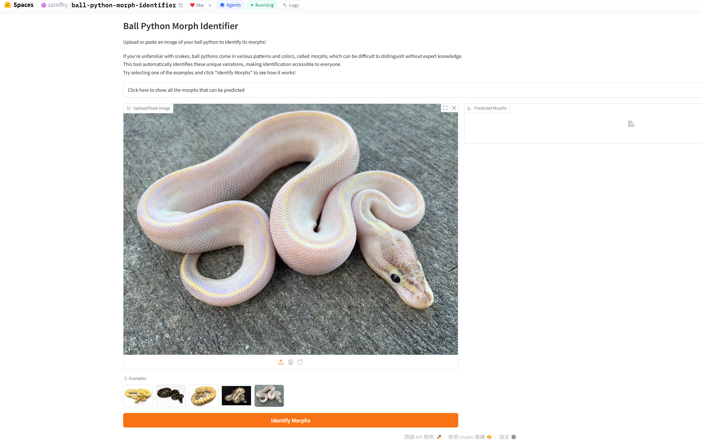
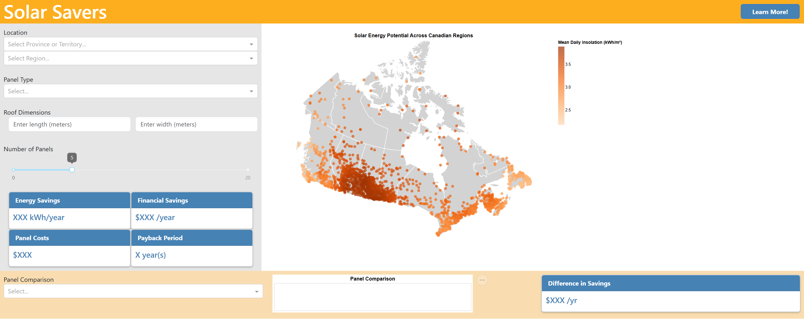

```{=html}
<div class="page">

  <div class="side">
    <div class="intro">
      <div class="hello">Hello &mdash;</div>
      <h1>This is <span class="accent">Sam</span>.</h1>
      <p>I&rsquo;m passionate about incorporating data into everyday life. Over on the right are a few things I&rsquo;ve built because I wanted to contribute to the communities I&rsquo;m in. Click through to try them live!</p>
      <a class="linkedin" href="https://www.linkedin.com/in/sam-fo-295b22172/" target="_blank" rel="noopener">
        <svg class="linkedin-icon" viewBox="0 0 24 24" fill="currentColor" aria-hidden="true"><path d="M20.45 20.45h-3.56v-5.57c0-1.33-.03-3.04-1.85-3.04-1.86 0-2.15 1.45-2.15 2.95v5.66H9.34V9h3.41v1.56h.05c.48-.9 1.64-1.85 3.37-1.85 3.6 0 4.27 2.37 4.27 5.46v6.28zM5.34 7.43a2.07 2.07 0 11.01-4.13 2.07 2.07 0 010 4.13zm1.78 13.02H3.56V9h3.56v11.45zM22.22 0H1.77C.79 0 0 .77 0 1.73v20.54C0 23.23.79 24 1.77 24h20.45C23.2 24 24 23.23 24 22.27V1.73C24 .77 23.2 0 22.22 0z"/></svg>
        <span>Connect on LinkedIn</span>
        <span class="arrow">&rarr;</span>
      </a>
    </div>
  </div>

  <div class="main">

  <div class="section-label">Projects</div>

  <article class="featured">
    <div class="featured-content">
      <div class="featured-eyebrow">Featured &middot; Vision Model</div>
      <h2>Ball Python Morph Identifier</h2>
      <p class="featured-desc">
        I had kept pet snakes for over ten years, so I built a classifier that identifies the different morphs
        a ball python carries from a photo. Snakes are incredibly cute and beautiful!
      </p>
      <div class="meta-row">
        <span class="tag">PyTorch</span>
        <span class="tag">Hugging Face</span>
        <span class="status">Live</span>
      </div>
      <a class="cta" href="https://huggingface.co/spaces/samfhy/ball-python-morph-identifier" target="_blank" rel="noopener">
        Open on Hugging Face <span class="arrow">&rarr;</span>
      </a>
    </div>
    <div class="featured-image">
      
    </div>
  </article>

  <div class="more-label">More projects</div>

  <div class="projects">

    <a class="project-row" href="https://dsci-532-2024-9-solar-savers.onrender.com/" target="_blank" rel="noopener">
      <div class="row-thumb"></div>
      <div class="row-body">
        <div class="row-eyebrow">Dashboard</div>
        <h3 class="row-title">Solar Savers</h3>
        <p class="row-desc">I had to research extensively to decide whether installing solar panels was worth it for my old family house so I built a handy dashboard for those who wants to do the same.</p>
        <div class="row-meta">
          <span class="tag">Python</span>
          <span class="tag">Dash</span>
          <span class="tag">Plotly</span>
          <span class="status">Live</span>
        </div>
      </div>
      <span class="row-arrow">&rarr;</span>
    </a>

  </div>

  </div><!-- /.main -->

</div>
```
